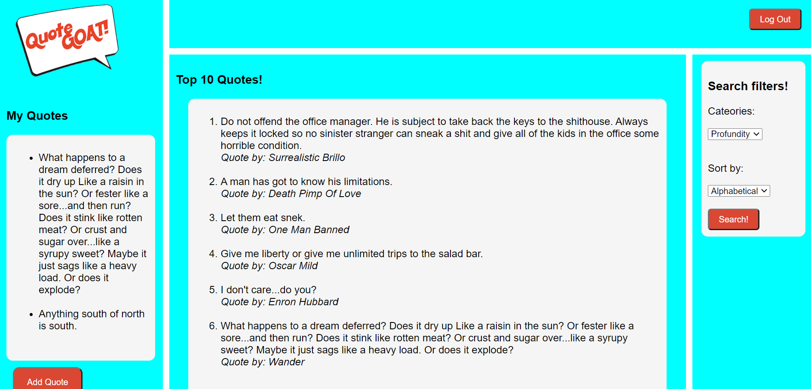

# QuoteGOAT

## Authors
* Beki G https://github.com/Beki-G
* Ty G https://github.com/tygerhardt
* Josh B https://github.com/Jmnblnk54
* Joe M https://github.com/joemengis
* Heather S https://github.com/Wanderingtech

## License

This project is protected under the MIT license.
   

## Table of Contents:

* [Description](#description)
* [Usage](#usage)
* [Installation](#installation)
* [Dependancies](#dependancies)
* [Improvements](#improvements)
* [Links](#links)

## Description

A quote collective. Explore, categorize, and vote on the best things said by your every day people, including yourself.

## Usage

Users can learn quotes by every day people like them. Vote on them based on their category. And add quotes of their own.

## Installation

Please run these commands to install dependancies for this project: npm i

## Dependancies

* bcryptjs
* dotenv
* eslint
* express
* express-handlebars
* express-session
* mysql
* mysql2
* passport
* passport-local
* path
* sequelize

## Improvements

* User validation
* Quote validation

## Links

Deployed App:
https://quotegoat.herokuapp.com/